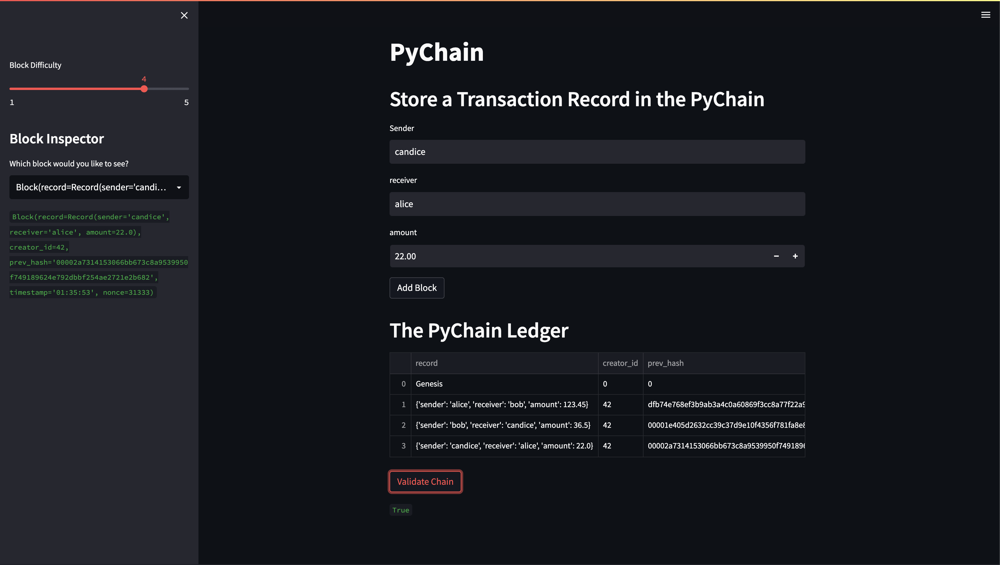

# Blockchain Ledger

`pychain.py` contains a lightweight web interface to interact with a simple blockchain ledger. Each block of the blockchain contains basic transaction information (sender, receiver, amount). The block also contains the timestamp of block creation and the hash of the previous block in thet chain. The interface allows adding blocks to the blockchain with a configurable proof of work, inspecting individual block data, and validating that the entire chain's hashes are valid.




To run the web interface:
```bash
$ streamlit run pychain.py
or
$ python -m streamlit run pychain.py
```


Required libraries:
- `streamlit`
- `pandas`
